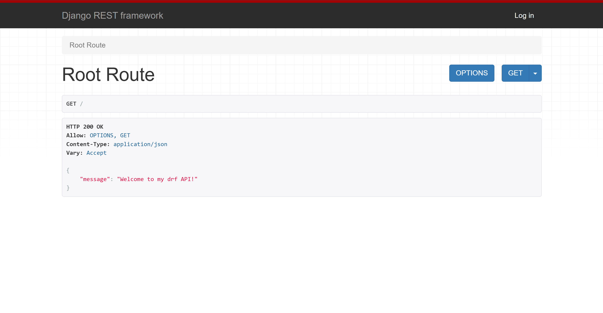
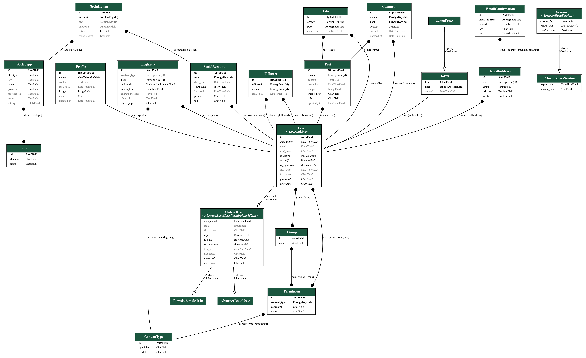

# Django RestFramwork - Backend

## Introduction



Welcome to my Restful API, created for a frontend social media page.

This API encompasses all the necessary logic that enables users to perform CRUD operations on the frontend.

Users can sign up to engage in activities such as uploading images, liking and commenting on them.

## Table of Contents

- [Django RestFramwork - Backend](#django-restframwork---backend)
  - [Introduction](#introduction)
  - [Table of Contents](#table-of-contents)
  - [Design](#design)
    - [Entity Relational Diagram](#entity-relational-diagram)
  - [Testing](#testing)
    - [Unit Tests](#unit-tests)
    - [Validation](#validation)
    - [Manual Testing](#manual-testing)
      - [root\_route](#root_route)
      - [Profiles](#profiles)
    - [Followers](#followers)
      - [Comments](#comments)
      - [Likes](#likes)
      - [Posts](#posts)
  - [Deployment](#deployment)
    - [Cloning and Forking](#cloning-and-forking)
  - [Technologies Used](#technologies-used)
    - [Languages](#languages)
    - [Frameworks](#frameworks)
    - [Libraries](#libraries)
      - [Authentication](#authentication)
      - [Database](#database)
      - [Image Handling](#image-handling)
      - [Utilities](#utilities)
    - [Database Used](#database-used)
    - [Image Storage](#image-storage)
    - [Deployment Service](#deployment-service)

## Design

### Entity Relational Diagram

In my design phase, I mapped out my models using a spreadsheet.

- **My Profiles Model:**

  This module implements a Profile model in Django to manage additional user information beyond what is provided by the default User model. It includes an automatic mechanism to create a profile for each new user upon registration.

- **My Post Model:**

  This module implements a Post model in Django for managing user-generated content, including text, images, and image filters. It is designed to work seamlessly with Django's User model, associating each post with its creator.

- **My Comments Model:**

  This module implements a Follower model in Django to manage user-following relationships, where one user can follow another. The model ensures that a user can only follow another user once, preventing duplicate follow entries.

- **My Likes Model:**

  This module implements a Like model in Django to manage user interactions with posts, specifically "likes." The model ensures that each user can only like a post once while maintaining a record of all likes.

- **My Comments Model:**

  This feature is absent in the Moments project.
  Users have the ability to report posts if they find the content inappropriate for any reason.

The results can be visualized here:



## Testing

### Unit Tests

I have developed approximately automated tests for my posts, all of which have passed.

```
from django.contrib.auth.models import User
from .models import Post
from rest_framework import status
from rest_framework.test import APITestCase


class PostListViewTests(APITestCase):
    def setUp(self):
        User.objects.create_user(username='adam', password='pass')

    def test_can_list_posts(self):
        adam = User.objects.get(username='adam')
        Post.objects.create(owner=adam, title='a title')
        response = self.client.get('/posts/')
        self.assertEqual(response.status_code, status.HTTP_200_OK)
        print(response.data)
        print(len(response.data))

    def test_logged_in_user_can_create_post(self):
        self.client.login(username='adam', password='pass')
        response = self.client.post('/posts/', {'title': 'a title'})
        count = Post.objects.count()
        self.assertEqual(count, 1)
        self.assertEqual(response.status_code, status.HTTP_201_CREATED)

    def test_user_not_logged_in_cant_create_post(self):
        response = self.client.post('/posts/', {'title': 'a title'})
        self.assertEqual(response.status_code, status.HTTP_403_FORBIDDEN)


class PostDetailViewTests(APITestCase):
    def setUp(self):
        adam = User.objects.create_user(username='adam', password='pass')
        brian = User.objects.create_user(username='brian', password='pass')
        Post.objects.create(
            owner=adam, title='a title', content='adams content'
        )
        Post.objects.create(
            owner=brian, title='another title', content='brians content'
        )

    def test_can_retrieve_post_using_valid_id(self):
        response = self.client.get('/posts/1/')
        self.assertEqual(response.data['title'], 'a title')
        self.assertEqual(response.status_code, status.HTTP_200_OK)

    def test_cant_retrieve_post_using_invalid_id(self):
        response = self.client.get('/posts/999/')
        self.assertEqual(response.status_code, status.HTTP_404_NOT_FOUND)

    def test_user_can_update_own_post(self):
        self.client.login(username='adam', password='pass')
        response = self.client.put('/posts/1/', {'title': 'a new title'})
        post = Post.objects.filter(pk=1).first()
        self.assertEqual(post.title, 'a new title')
        self.assertEqual(response.status_code, status.HTTP_200_OK)

    def test_user_cant_update_another_users_post(self):
        self.client.login(username='adam', password='pass')
        response = self.client.put('/posts/2/', {'title': 'a new title'})
        self.assertEqual(response.status_code, status.HTTP_403_FORBIDDEN)
```

### Validation

All files that I created or modified were checked using the [PEP8 CI python linter](https://pep8ci.herokuapp.com/), with no errors or warnings found.

### Manual Testing

Every item listed under "Works" was manually tested, and marked with an X for yes if it functions correctly, or no if it does not.

#### root_route

|Works                                              |YES |NO |
|---------------------------------------------------|:---:|---|
|The root_route URL loads                           |X  |   |
|Welcome message is displayed on the landing page   |X  |   |

#### Profiles

| Works                                                                | YES | NO |
|---------------------------------------------------------------------|:---:|---|
| `profiles/` is accessible without logging in, as read-only          | X  |   |
| `profiles/<int:pk>/` is accessible without logging in, as read-only | X  |   |
| `profiles/<int:pk>/` is accessible without logging in, as read-only | X  |   |
| A new profile is created for the user upon registration              | X  |   |
| As the owner, I can update my profile                               | X  |   |
| I can add a profile image                                            | X  |   |
| If I don't own the profile, I can only view it                      | X  |   |

### Followers

| Works                                                                      | YES | NO |
|---------------------------------------------------------------------------|:---:|---|
| `followers/` is accessible without logging in, as read-only                | X   |   |
| `followers/<int:pk>/` is accessible without logging in, as read-only       | X   |   |
| A user can follow another user (i.e., create a follower relationship)     | X   |   |
| A user cannot follow the same user more than once                          | X   |   |
| As the owner, I can unfollow (delete) a user from my followers            | X   |   |
| A user can see a list of users they are following                         | X   |   |
| A user can see a list of users who are following them                     | X   |   |
| A user can check if they are following another user                       | X   |   |
| If a user is following another user, they are listed in the follower list | X   |   |
| If a user is not following another user, they are not listed in the follower list | X   |   |
| A user cannot follow themselves                                           | X   |   |

#### Comments

|Works                                                                |YES |NO |
|---------------------------------------------------------------------|:---:|---|
|`comments/` is accessible if not logged in as read-only              |X  |   |
|`comments/<int:pk>/` is accessible if not logged in as read-only     |X  |   |
|Users can read comments but cannot create them if not logged in      |X  |   |
|If signed in, users can create a comment                            |X  |   |
|Comments cannot be edited if the user is not logged in              |X  |   |
|Comments cannot be deleted if the user is not logged in             |X  |   |
|Comments can be edited by their owner                                |X  |   |
|Comments can be deleted by their owner                               |X  |   |

#### Likes

|Works                                                                |YES |NO |
|---------------------------------------------------------------------|:---:|---|
|`likes/` is accessible if not logged in as read-only                 |X  |   |
|`likes/<int:pk>/` is accessible if not logged in as read-only        |X  |   |
|Users can see likes even when not logged in                         |X  |   |
|Users cannot add likes if not logged in                             |X  |   |
|If signed in, users can add a like to a post                        |X  |   |
|If signed in, users can add a like to a comment                     |X  |   |
|Likes cannot be deleted if the user is not logged in as the owner   |X  |   |
|Likes can be deleted if logged in as their owner                    |X  |   |
|Users cannot like the same item more than once                     |X  |   |

#### Posts

|Works                                                                    |YES |NO |
|-------------------------------------------------------------------------|:---:|---|
|`posts/` is accessible if not logged in as read only                     |X  |   |
|`posts/<int:pk>/` is accessible if not logged in as read only            |X  |   |
|`posts/<int:pk>/download/` is not accessible if not logged in            |X  |   |
|I can see but not add posts if not logged in                             |X  |   |
|If I am signed in, I can add a post                                      |X  |   |
|Posts can not be edited if not logged in as the owner                    |X  |   |
|Posts can not be deleted if not logged in as its owner                   |X  |   |
|Posts can be edited by its owner                                         |X  |   |
|Posts can be deleted by its owner                                        |X  |   |
|comments_count increments by one when I add a comment to a post          |X  |   |
|likes_count increments by one when I add a like to a post                |X  |   |
|I can upload an image to a post                                          |X  |   |
|File extension must be jpg, jpeg or png when uploading an image          |X  |   |
|If file extension is not jpg, jpeg or png an error informs the user      |X  |   |


## Deployment

I began by setting up a database on [Elephant SQL](https://www.elephantsql.com/).

On [Heroku](https://www.heroku.com/), I created my app. In the app's settings page, I added the following configuration variables:

- **DATABASE_URL** with the value of my PostgreSQL server URL.
- **SECRET_KEY** with a value obtained from [Djecrety](https://djecrety.ir/).
- **DISABLE_COLLECTSTATIC** set to 1.
- **CLOUDINARY_URL** with the value of my Cloudinary API environment variable.

In my IDE, I installed `dj_database_url` and `psycopg2` using the command:

- ```pip3 install dj_database_url==0.5.0 psycopg2```

Then, include `dj_database_url` in your `settings.py` file.

In `settings.py`, I modified the Database section to utilize my local `db.sqlite3` server during development, 

and switch to my PostgreSQL server in production.

Here's the code snippet for that:

```python
if 'DEV' in os.environ:
    DATABASES = {
        'default': {
            'ENGINE': 'django.db.backends.sqlite3',
            'NAME': BASE_DIR / 'db.sqlite3',
        }
    }
else:
    DATABASES = {
        'default': dj_database_url.parse(os.environ.get("DATABASE_URL"))
    }
```

Next, I added os.environ['DATABASE_URL'] = 'my-ElephantSQL-database-url' to my env.py file.

In the same env.py, I also defined os.environ['DEV'] = '1', allowing me to implement conditional logic in settings.py,

enabling a seamless switch between development and production environments.

Temporarily comment out the DEV variable in the env.py file to allow the IDE to connect to the external database.

In settings.py, insert a print statement here:

```
else:
    DATABASES = {
        'default': dj_database_url.parse(os.environ.get("DATABASE_URL"))
    }
    print("connected to external database")
```

Then, run the following command in your terminal:

- ```python3 manage.py makemigrations --dry-run```

You should see: "connected to external database" printed in the terminal.

Remove the print statement and proceed to migrate the database:

- ```python3 manage.py migrate```

To create a superuser, run:

- ```python3 manage.py createsuperuser```

Next, navigate to Elephant SQL, and select the database you just created.

On the left side navigation, click "Browser", then choose "Table queries", and from the list, select "auth_user".

Finally, click "Execute", and you should see your superuser listed.

Back in the IDE, I installed gunicorn and django-cors-headers using the following command:

- ```pip3 install gunicorn django-cors-headers```

Gunicorn is necessary for deploying to Heroku, and we need django-cors-headers

since the frontend and backend will be hosted on different domains.

To save the installed packages to requirements.txt, run:

pip freeze --local > requirements.txt
Create a Procfile in the root directory, and add the following content:

- ```pip freeze --local > requirements.txt```

Create a Procfile in the root directory, and add this inside:

```
release: python manage.py makemigrations && python manage.py migrate
web: gunicorn <your-project-name>.wsgi
```

InIn settings.py, I included os.environ.get('ALLOWED_HOST') in ALLOWED_HOSTS,

and in env.py, I added os.environ['ALLOWED_HOST'] = ''.

I implemented this after my first deployment, which prevented me from accessing my project,

but with the deployed URL now available, I returned to my app on Heroku, navigated to settings, revealed config vars, and entered ALLOWED_HOST with the value of my deployed URL.

Back in the IDE, I added 'corsheaders' to INSTALLED_APPS.

I also added 'corsheaders.middleware.CorsMiddleware', to the top of the MIDDLEWARE list in settings.py.

Continuing in settings.py, we need to establish some allowed origins for CORS

to ensure network requests aren’t blocked. Note that this code is tailored specifically for use with GitPod

and may require different configurations for your setup.

```
if 'CLIENT_ORIGIN' in os.environ:
    CORS_ALLOWED_ORIGINS = [
        os.environ.get('CLIENT_ORIGIN')
    ]
if 'CLIENT_ORIGIN_DEV' in os.environ:
    extracted_url = re.match(
        r'^.+-', os.environ.get('CLIENT_ORIGIN_DEV', ''),
        re.IGNORECASE
        ).group(0)
    CORS_ALLOWED_ORIGIN_REGEXES = [
        rf"{extracted_url}(eu|us)\d+\w\.gitpod\.io$",
    ]
```

We also need to ensure that we can send cookies across origins for authentication purposes.

So, add ```CORS_ALLOW_CREDENTIALS = True``` to settings.py.

Since the frontend app and this API will be deployed to different URLs,

the JWT_AUTH_SAMESITE needs to be set to a value of None in settings.py, or cookies will be blocked:

```
REST_AUTH = {
    'USE_JWT': True,
    'JWT_AUTH_SECURE': True,
    'JWT_AUTH_COOKIE': 'my-app-auth',
    'JWT_AUTH_REFRESH_COOKIE': 'my-refresh-token',
    'JWT_AUTH_SAMESITE': 'None',
    'USER_DETAILS_SERIALIZER': 'api.serializers.CurrentUserSerializer'
}
```

Ensure that you replaced your SECRET_KEY with something similar to this:

```SECRET_KEY = os.getenv('SECRET_KEY')```, and make sure to set a new value for it

in `env.py` or another secure file that you won't push to a public repository.

I added this to my `env.py`: ```os.environ.setdefault("SECRET_KEY", "MyNewRandomValueHere")```

I modified the `DEBUG` setting in `settings.py` to: ```DEBUG = 'DEV' in os.environ```,

which makes it easier to avoid toggling `DEBUG` between True and False during development.

Next, I uncommented the `DEV` line in `env.py`.

Again, I verified that my `requirements.txt` was up-to-date, and then pushed the changes to GitHub.

On Heroku, open the deploy tab for the app, select "Connect to GitHub",

search for the repository, and click connect.

Finally, click "Deploy Branch". Once the build process completes, your app should open and function as expected.

### Cloning and Forking

If you wish to clone or fork this project, you can do so from my [GitHub repository](https://github.com/FloriHaas/Django-RestFrameworkAPI).

It's advisable to set up a virtual environment first.

**Cloning** the project allows you to create a local copy of the project on your machine,

enabling you to make modifications without affecting the original repository.

**Forking** it creates a copy of the project in your own GitHub account,

allowing you to propose changes to the original project 

or develop your modified version of it.

Next, you will need to reinstall the dependencies listed in the `requirements.txt` file using:

- ```pip install -r requirements.txt```

You will also have to configure your own environment variables.

## Technologies Used

### Languages

This API was developed using Python.

### Frameworks

- Django
  
  The primary framework that serves as the foundation for this API.

- django-rest-framework
  
  A framework built on top of Django, used for crafting RESTful APIs.

### Libraries

#### Authentication

- dj-rest-auth
  
  Enables `django-rest-framework` to provide authentication endpoints easily.

- django-allauth
  
  A comprehensive authentication application for Django.

- djangorestframework-simplejwt
  
  JSON Web Token-based authentication, which will be utilized for authentication from the frontend.

#### Database

- dj-database-url
  
  Assists in parsing URLs for straightforward configuration in Django.

- psycopg2
  
  A PostgreSQL adapter for Python.

#### Image Handling

- cloudinary
  
  Facilitates interaction with Cloudinary, a cloud-based image storage service.

- django-cloudinary-storage
  
  Integrates Cloudinary for media storage within Django.

- Pillow
  
  Used for image processing tasks.

#### Utilities

- gunicorn
  
  A WSGI server used in production, necessary for deployment.

- django-cors-headers
  
  Adds Cross-Origin Resource Sharing headers to allow requests to a Django application from other origins.

### Database Used

For this project, I employed a PostgreSQL database via [Elephant SQL](https://www.elephantsql.com/).

### Image Storage

I utilized [Cloudinary](https://cloudinary.com/) for image storage.

### Deployment Service

The project was deployed using [Heroku](https://www.heroku.com/).